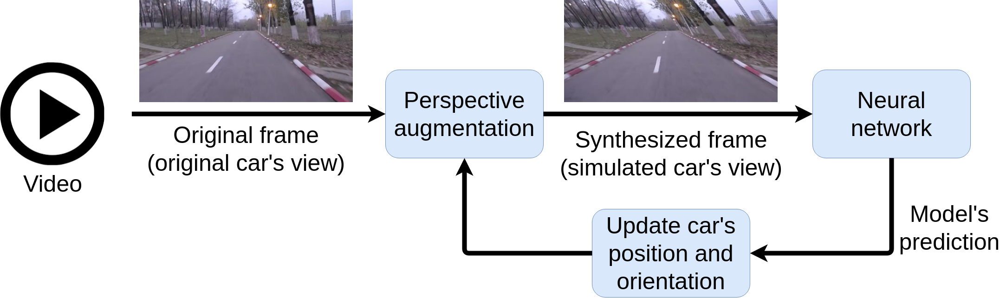

# Steering-Evaluator-1

<p align="center">
  
</p>

<p align="center">
  
</p>

<p align="center">
  
</p>  
  
<p align="center">
  
</p>


## Create dataset

```shell
mkdir raw_dataset
```

* Download the UBP dataset into the "raw_dataset" directory. A sample of the UPB dataset is available <a href="https://drive.google.com/drive/folders/1p_2-_Xo-Wd9MCnkYqPfGyKs2BnbeApqn?usp=sharing">here</a>.

```shell
mkdir scene_splits
```

* Download the scene splits into the "scene_splits" directory. The train-validation split is available <a href="https://github.com/RobertSamoilescu/UPB-Dataset-Split">here</a>.
In the "scene_splits" directory you should have: "train_scenes.txt" and "test_scenes.txt".


## Load models

```shell
mkdir ckpts
```

* Train models using <a href="https://github.com/RobertSamoilescu/Steering-Network-1">this repo</a>

* Copy the folders inside the snapshots dir into the ckpts dir.

## Test models - closed-loop evaluation

```shell
./run.sh
```

## Results

|Model      | AG | A     | NI     | MAD/MSTI| MAA/MSTI | VL+P   |
|-----------|----|-------|--------|---------|----------|--------|
|Baseline   | *  | 0.45  | 620    | 0.0277  | 0.2390   |6780.16 |     
|Simple     | No | 0.66  | 267    | 0.0137  | 0.0814   |4662.16 |
|ResNet18   | No | 0.67  | 248    | 0.0130  | 0.0731   |4548.16 |
|Simple     | Yes| 0.76  | 165    | 0.0060  | 0.0485   |4050.16 |
|ResNet18   | Yes| 0.80  | 128    | 0.0048  | 0.0393   |3828.16 |

Closed-loop evaluation using 2D perspective augmentations over $3060.16$[s]. The model receives as input an RGB frame, and the speed. Abbreviations: 2D perspective augmentation applied during training(AG), autonomy (A), number of interventions (NI), mean absolute distance (MAD), mean absolute angle (MAA), mean steps till intervention (MSTI), video length (VL), penalty(P).

## Visualize intervention points
```shell
python3 view.py
```

<p align="center">
  
</p>
